# WhatsApp RAG Chat with SurrealDB

A Retrieval-Augmented Generation (RAG) chatbot that analyzes your WhatsApp conversations using vector embeddings and LLMs.

## 🏗️ Architecture

This project uses a **hybrid AI infrastructure**:
- **Ollama** (port 11434) - For embedding models
- **Docker Model Runner** (port 12434) - For LLM (chat/generation) models
- **SurrealDB** - Vector database for storing embeddings

```mermaid
graph TB
    subgraph AI["🤖 AI Infrastructure"]
        direction LR
        subgraph Ollama["Ollama Service"]
            O1["Port: 11434"]
            O2["Model: all-minilm:22m"]
            O3["Purpose: Embeddings"]
        end
        
        subgraph DMR["Docker Model Runner"]
            D1["Port: 12434"]
            D2["Model: ai/llama3.2:3B-Q4_0"]
            D3["Purpose: LLM/Chat"]
        end
    end
    
    App["Python Application<br/>(langchain-ollama)"] -.->|Embedding Requests| Ollama
    App -.->|LLM Requests| DMR
    
    style AI fill:#e1f5ff,stroke:#01579b,stroke-width:2px
    style Ollama fill:#fff3e0,stroke:#e65100,stroke-width:2px
    style DMR fill:#f3e5f5,stroke:#4a148c,stroke-width:2px
    style App fill:#e8f5e9,stroke:#1b5e20,stroke-width:2px
```



## 📋 Requirements

- **Python 3.14+**
- **Docker Desktop** with Docker Model Runner enabled
- **Ollama** installed and running
- **SurrealDB** running via Docker Desktop Extension

## 🚀 Setup Instructions

### 1. Create Virtual Environment
```bash
python3.14 -m venv venv
source venv/bin/activate
```

### 2. Install Dependencies
```bash
pip install -r requirements.txt
```

### 3. Prepare Your WhatsApp Chat

1. Open WhatsApp on your phone
2. Go to Chat → More options (⋮) → Export Chat
3. Select a chat and choose "Without Media"
4. Save the file as `whatsappChatExport.txt` in the project directory

### 4. Install and Start Ollama (for Embeddings)

Docker Model Runner doesn't support embedding models yet, so we use Ollama for embeddings.

**Option 1: Install Ollama Desktop App**
1. Download from [https://ollama.ai](https://ollama.ai)
2. Install and run the app
3. Pull the embedding model:
   ```bash
   ollama pull all-minilm:22m
   ```

**Option 2: Run Ollama in Terminal**
```bash
# Install Ollama (if not already installed)
# Visit https://ollama.ai for installation instructions

# Start Ollama server
ollama serve

# In another terminal, pull the model
ollama pull all-minilm:22m
```

### 5. Enable Docker Model Runner (for LLM)

Docker Model Runner will handle the LLM (chat/generation) models.

1. Open **Docker Desktop**
2. Go to **Settings** → **Features in development**
3. Enable **Docker Model Runner**
4. Restart Docker Desktop if prompted

### 6. Pull LLM Model

```bash
# Pull the LLM model for chat/generation
docker model pull ai/llama3.2:3B-Q4_0
```

To verify the model is available:
```bash
docker model ls
```

### 7. Start SurrealDB via Docker Desktop
1. Open **Docker Desktop**
2. Go to **Extensions**
3. Find and start **SurrealDB** extension
4. Ensure it's running on `ws://localhost:8000`

### 8. Load WhatsApp Messages into SurrealDB
```bash
./venv/bin/python load_whatsapp.py
```

You should see: `✓ Loaded X messages into SurrealDB`

## 💻 Usage

### Quick Start (Recommended)
```bash
# Make sure SurrealDB is running via Docker Desktop Extension first!
# Then:

# Step 1: Load your WhatsApp messages
./venv/bin/python load_whatsapp.py

# Step 2: Start the web UI
./venv/bin/python rag_chat_ui.py
```

Then open your browser to: **http://localhost:8080**

---

### Web UI with NiceGUI (Primary Interface)
```bash
./venv/bin/python rag_chat_ui.py
```

**Features:**
- Beautiful interactive chat interface
- Full source citations with metadata
- Confidence scores for each match
- Sender information & timestamps
- Complete conversation history

### Alternative: Interactive Terminal Chat
```bash
./venv/bin/python rag_chat_interactive.py
```

**Features:**
- Command-line interface
- Relevant source message display
- Confidence scores
- Quick testing without web browser

## 📁 Project Files

- `load_whatsapp.py` - Loads WhatsApp messages into SurrealDB
- `rag_chat_interactive.py` - Terminal-based interactive chat
- `rag_chat_ui.py` - Web UI with NiceGUI frontend
- `whatsappChatExport.txt` - Your exported WhatsApp chat
- `requirements.txt` - Python dependencies

## 🔧 Configuration

### Current Setup
```python
# Embeddings: Ollama (port 11434)
EMBEDDING_SERVER_URL = "http://localhost:11434"
EMBEDDING_MODEL = "all-minilm:22m"

# LLM: Docker Model Runner (port 12434)
LLM_SERVER_URL = "http://localhost:12434"
LLM_MODEL = "ai/llama3.2:3B-Q4_0"
```

### Environment Details

- **Python Version**: 3.14.2
- **Main Dependencies**:
  - `langchain-community` - LLM framework
  - `langchain-ollama` - Ollama-compatible API integration
  - `surrealdb` - Vector database
  - `nicegui` - Web UI framework
- **AI Infrastructure**:
  - Ollama - Embedding model serving (port 11434)
  - Docker Model Runner - LLM serving (port 12434)

## 🔄 How It Works

1. **Load**: WhatsApp messages are parsed and stored in SurrealDB with embeddings
2. **Search**: User questions are converted to vectors and searched against stored messages
3. **Generate**: Relevant messages are used as context for the LLM
4. **Answer**: LLM generates an answer with source citations

### Architecture Diagram

```mermaid
graph TD
    A["📱 WhatsApp Chat Export"] -->|Parse & Extract| B["📝 Raw Messages"]
    B -->|Embed with Ollama<br/>all-minilm| C["🔢 Vector Embeddings"]
    C -->|Store| D["🗄️ SurrealDB<br/>Vector Store"]
    
    E["👤 User Question"] -->|Embed| F["🔢 Query Vector"]
    F -->|Similarity Search<br/>k=3| D
    D -->|Retrieve Top Matches| G["📚 Relevant Context<br/>+ Metadata"]
    
    G -->|With Context| H["🤖 Docker Model Runner<br/>ai/llama3.2"]
    H -->|Generate Answer| I["💬 AI Response"]
    
    I -->|Display with<br/>Citations| J["🌐 NiceGUI Web Interface<br/>or Terminal"]
    
    G -.->|Show Sources| K["📖 Source Citations<br/>Sender, Timestamp,<br/>Confidence Score"]
    K -->|Display| J
```



### Data Flow Diagram


### Component Architecture


## 🐛 Troubleshooting

### Ollama Not Responding
```bash
# Check if Ollama is running
curl http://localhost:11434/api/tags

# If not running, start it
ollama serve

# Verify models
ollama list
```

### Docker Model Runner Not Responding
```bash
# Check if enabled in Docker Desktop
# Settings → Features in development → Docker Model Runner

# Verify models
docker model ls

# Test endpoint
curl http://localhost:12434/api/tags
```

### Error: `{"error": "unknown error"}`

This usually means incorrect model name format. Make sure you're using:
- **Ollama models**: `model-name:tag` (e.g., `all-minilm:22m`)
- **Docker Model Runner**: `ai/model-name:tag` (e.g., `ai/llama3.2:3B-Q4_0`)

### Connection Refused to SurrealDB
- **Solution**: Make sure Docker Desktop is running and SurrealDB extension is started
  - Open Docker Desktop → Extensions → SurrealDB → Start

### `ModuleNotFoundError` when running scripts
- **Solution**: Make sure virtual environment is activated: `source venv/bin/activate`
- Or use full path: `./venv/bin/python script.py`

### "No relevant information found"
- **Solution**: Make sure WhatsApp messages are loaded first
- Run: `./venv/bin/python load_whatsapp.py`

### Web UI won't start
- **Solution**: Check if port 8080 is available
- Or modify the port in `rag_chat_ui.py`: `ui.run(port=8081)`

## 📊 Port Reference

| Service | Port | Purpose | Model |
|---------|------|---------|-------|
| **Ollama** | 11434 | Embeddings | `all-minilm:22m` |
| **Docker Model Runner** | 12434 | LLM/Chat | `ai/llama3.2:3B-Q4_0` |
| **SurrealDB** | 8000 | Vector DB | N/A |
| **Web UI** | 8080 | Interface | N/A |

## 🔍 Verify Your Setup

### Check All Services
```bash
# 1. Check Ollama
curl http://localhost:11434/api/tags

# 2. Check Docker Model Runner
curl http://localhost:12434/api/tags

# 3. Check SurrealDB (should be running in Docker Desktop)
# Look for SurrealDB in Docker Desktop Extensions

# 4. List available models
ollama list
docker model ls
```

### Test Embeddings
```bash
curl http://localhost:11434/api/embeddings -d '{
  "model": "all-minilm:22m",
  "prompt": "test"
}'
```

### Test LLM
```bash
curl http://localhost:12434/api/generate -d '{
  "model": "ai/llama3.2:3B-Q4_0",
  "prompt": "Hello",
  "stream": false
}'
```

## 🎯 Alternative Models

### Embedding Models (Ollama)
```bash
# Lightweight, fast (recommended)
ollama pull all-minilm:22m

# High quality embeddings
ollama pull nomic-embed-text

# Large embedding model
ollama pull mxbai-embed-large
```

### LLM Models (Docker Model Runner)
```bash
# Meta's Llama 3.2 (recommended)
docker model pull ai/llama3.2:3B-Q4_0

# Coding assistant
docker model pull ai/qwen2.5-coder

# Microsoft's Phi-3
docker model pull ai/phi3

# Small, fast model
docker model pull ai/smollm2
```

## 🤝 Contributing

We welcome contributions! Here's how you can help:

### Getting Started
1. Fork the repository
2. Clone your fork: `git clone https://github.com/your-username/surrealdb-rag-demo.git`
3. Create a feature branch: `git checkout -b feature/your-feature-name`
4. Follow the setup instructions in the README

### Development Guidelines

**Code Style:**
- Follow PEP 8 conventions
- Use meaningful variable and function names
- Add docstrings to functions
- Keep functions focused and modular

**Before Submitting:**
1. Test your changes thoroughly
2. Run the scripts to ensure no errors
3. Update documentation if adding new features
4. Include descriptive commit messages

### Areas for Contribution

- **Features**: New chat models, database backends, enhanced UI components
- **Improvements**: Performance optimization, code refactoring, dependency updates
- **Documentation**: Better guides, API documentation, usage examples
- **Bug Fixes**: Report or fix issues you find
- **Tests**: Add unit tests and integration tests

### Submitting Changes

1. Push to your fork
2. Create a Pull Request with:
   - Clear description of changes
   - Reference to any related issues
   - Screenshots for UI changes (if applicable)
3. Wait for review and address feedback

### Reporting Issues

When reporting bugs, include:
- Python version and OS
- Steps to reproduce
- Error messages and stack traces
- Your environment details

### Questions?

Open an issue with the label `question` or start a discussion.

## 📝 License

MIT

---

## 📚 Additional Resources

- [Ollama Documentation](https://ollama.ai)
- [Docker Model Runner Documentation](https://docs.docker.com/ai/model-runner/)
- [SurrealDB Documentation](https://surrealdb.com/docs)
- [LangChain Documentation](https://python.langchain.com/)

## 🎉 Quick Tips

1. **First time setup**: Allow 10-15 minutes for model downloads
2. **Performance**: Embeddings are fast, LLM responses may take 5-30 seconds
3. **Model size**: Larger models = better quality but slower responses
4. **Context**: The system retrieves top 3 most relevant messages for context
5. **Privacy**: Everything runs locally - your data never leaves your machine

---

**Made with ❤️ using Ollama, Docker Model Runner, and SurrealDB**
