# WhatsApp RAG Chat with SurrealDB

A Retrieval-Augmented Generation (RAG) chatbot that analyzes your WhatsApp conversations using vector embeddings and LLMs.

## Requirements

- **Python 3.14** (specified in `.python-version`)
- **Docker Desktop** with SurrealDB extension installed
- Ollama with models: `all-minilm:22m` and `llama3.2:latest`

## Setup Instructions

### 1. Create Virtual Environment
```bash
python3.14 -m venv venv
source venv/bin/activate
```

### 2. Install Dependencies
```bash
pip install -r requirements.txt
```

### 3. Prepare Your WhatsApp Chat

1. Open WhatsApp on your phone
2. Go to Chat → More options (⋮) → Export Chat
3. Select a chat and choose "Without Media"
4. Save the file as `whatsappChatExport.txt` in the project directory

### 4. Start SurrealDB via Docker Desktop
1. Open **Docker Desktop**
2. Go to **Extensions**
3. Find and start **SurrealDB** extension
4. Ensure it's running on `ws://localhost:8000`

### 5. Load WhatsApp Messages into SurrealDB
```bash
./venv/bin/python load_whatsapp.py
```

You should see: `✓ Loaded X messages into SurrealDB`

## Usage

### Quick Start (Recommended)
```bash
# Make sure SurrealDB is running via Docker Desktop Extension first!
# Then:

# Step 1: Load your WhatsApp messages
./venv/bin/python load_whatsapp.py

# Step 2: Start the web UI
./venv/bin/python rag_chat_ui.py
```

Then open your browser to: **http://localhost:8080**

---

### Web UI with NiceGUI (Primary Interface)
```bash
./venv/bin/python rag_chat_ui.py
```

**Features:**
- Beautiful interactive chat interface
- Full source citations with metadata
- Confidence scores for each match
- Sender information & timestamps
- Complete conversation history

### Alternative: Interactive Terminal Chat
```bash
./venv/bin/python rag_chat_interactive.py
```

**Features:**
- Command-line interface
- Relevant source message display
- Confidence scores
- Quick testing without web browser

### Demo: Simple RAG Example
```bash
./venv/bin/python simple_rag.py
```

Quick demo with sample conversations

## Project Files

- `load_whatsapp.py` - Loads WhatsApp messages into SurrealDB
- `rag_chat_interactive.py` - Terminal-based interactive chat
- `rag_chat_ui.py` - Web UI with NiceGUI frontend
- `simple_rag.py` - Demo with sample data
- `whatsappChatExport.txt` - Your exported WhatsApp chat
- `requirements.txt` - Python dependencies

## Environment Details

- **Python Version**: 3.14.2
- **Main Dependencies**:
  - `langchain-community` - LLM framework
  - `langchain-ollama` - Local LLM integration
  - `surrealdb` - Vector database
  - `nicegui` - Web UI framework
  - `ollama` - LLM integration

## How It Works

1. **Load**: WhatsApp messages are parsed and stored in SurrealDB with embeddings
2. **Search**: User questions are converted to vectors and searched against stored messages
3. **Generate**: Relevant messages are used as context for the LLM
4. **Answer**: LLM generates an answer with source citations

### Architecture Diagram

```mermaid
graph TD
    A["📱 WhatsApp Chat Export"] -->|Parse & Extract| B["📝 Raw Messages"]
    B -->|Embed with all-minilm:22m| C["🔢 Vector Embeddings"]
    C -->|Store| D["🗄️ SurrealDB<br/>Vector Store"]
    
    E["👤 User Question"] -->|Embed| F["🔢 Query Vector"]
    F -->|Similarity Search<br/>k=3| D
    D -->|Retrieve Top Matches| G["📚 Relevant Context<br/>+ Metadata"]
    
    G -->|With Context| H["🤖 Ollama LLM<br/>llama3.2:latest"]
    H -->|Generate Answer| I["💬 AI Response"]
    
    I -->|Display with<br/>Citations| J["🌐 NiceGUI Web Interface<br/>or Terminal"]
    
    G -.->|Show Sources| K["📖 Source Citations<br/>Sender, Timestamp,<br/>Confidence Score"]
    K -->|Display| J
```



### Data Flow Diagram


### Component Architecture


## Troubleshooting

**Issue**: Connection refused to SurrealDB (ws://localhost:8000)
- **Solution**: Make sure Docker Desktop is running and SurrealDB extension is started
  - Open Docker Desktop → Extensions → SurrealDB → Start

**Issue**: `ModuleNotFoundError` when running scripts
- **Solution**: Make sure virtual environment is activated: `source venv/bin/activate`
- Or use full path: `./venv/bin/python script.py`

**Issue**: "No relevant information found"
- **Solution**: Make sure WhatsApp messages are loaded first
- Run: `./venv/bin/python load_whatsapp.py`

**Issue**: Web UI won't start
- **Solution**: Check if port 8080 is available
- Or modify the port in `rag_chat_ui.py`: `ui.run(port=8081)`

## Contributing

We welcome contributions! Here's how you can help:

### Getting Started
1. Fork the repository
2. Clone your fork: `git clone https://github.com/your-username/surrealdb-rag-demo.git`
3. Create a feature branch: `git checkout -b feature/your-feature-name`
4. Follow the setup instructions in the README

### Development Guidelines

**Code Style:**
- Follow PEP 8 conventions
- Use meaningful variable and function names
- Add docstrings to functions
- Keep functions focused and modular

**Before Submitting:**
1. Test your changes thoroughly
2. Run the scripts to ensure no errors
3. Update documentation if adding new features
4. Include descriptive commit messages

### Areas for Contribution

- **Features**: New chat models, database backends, enhanced UI components
- **Improvements**: Performance optimization, code refactoring, dependency updates
- **Documentation**: Better guides, API documentation, usage examples
- **Bug Fixes**: Report or fix issues you find
- **Tests**: Add unit tests and integration tests

### Submitting Changes

1. Push to your fork
2. Create a Pull Request with:
   - Clear description of changes
   - Reference to any related issues
   - Screenshots for UI changes (if applicable)
3. Wait for review and address feedback

### Reporting Issues

When reporting bugs, include:
- Python version and OS
- Steps to reproduce
- Error messages and stack traces
- Your environment details

### Questions?

Open an issue with the label `question` or start a discussion.

## License

MIT
